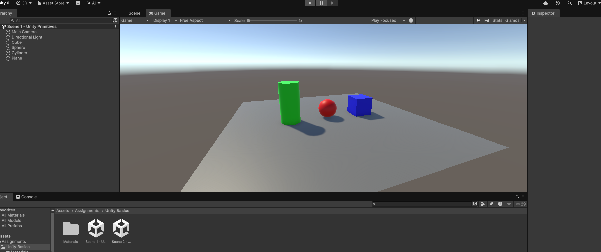
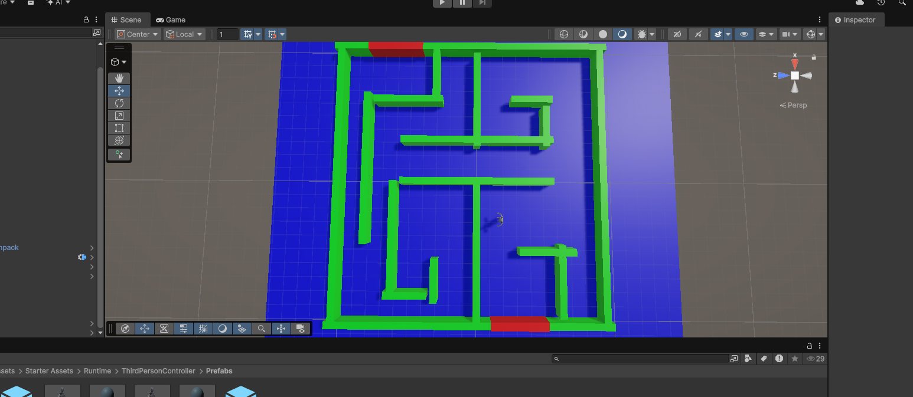
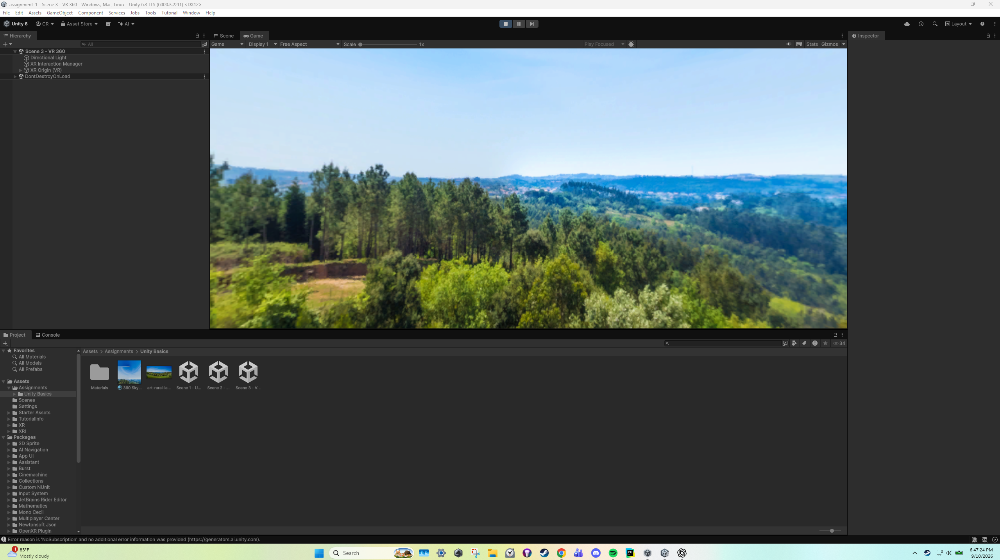

# CSC 461/592 - Assignment 1 Unity Basics

## Scene 1 - Unity Primitives

This scene contains three different 3D shapes with different colored materials.

## Scene 2 - Maze

This scene contains a maze that can be navigated using a character controller. 

## Scene 3 - VR 360

This scene uses a 360-degree panoramic skybox and an XR Origin to make the environment viewable in VR.

